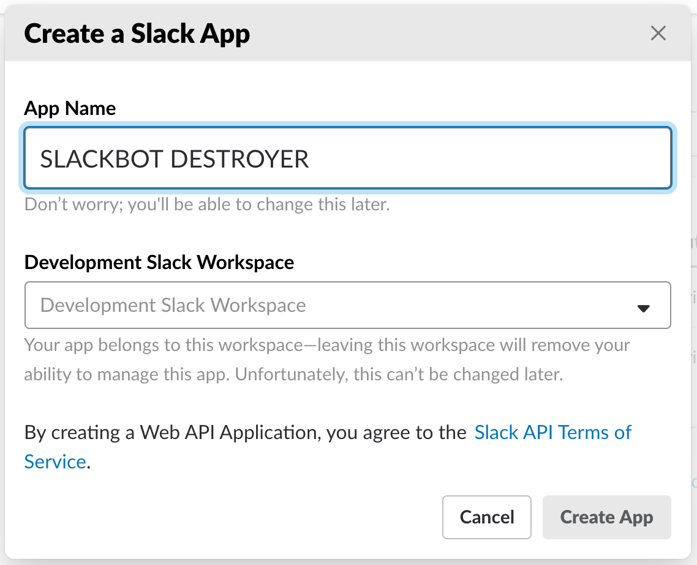
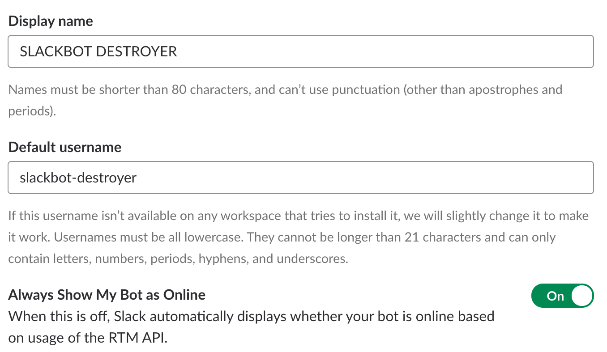
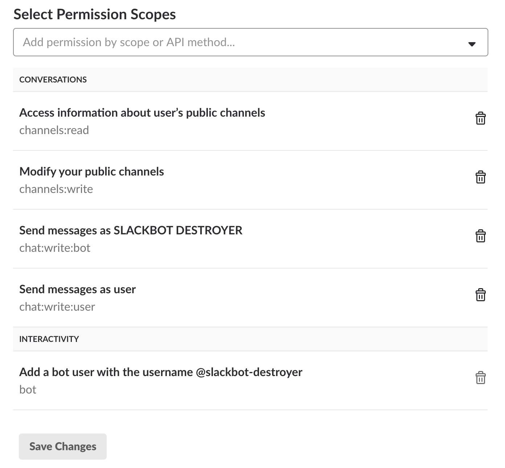
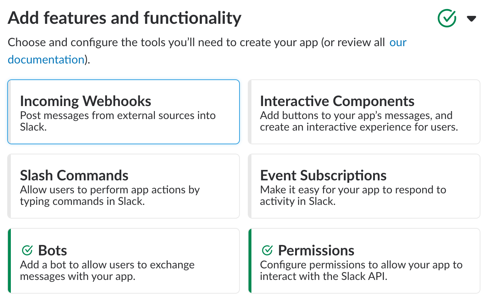
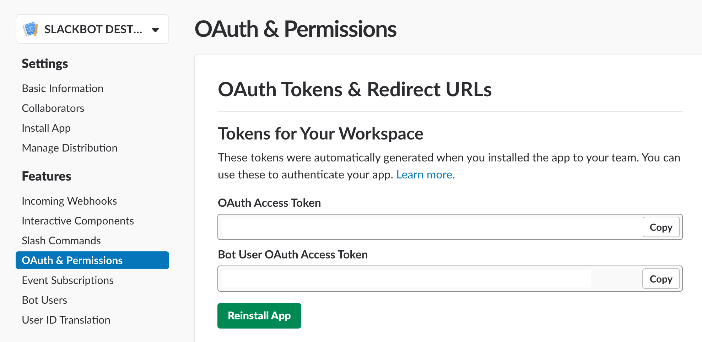

This repo takes inspiration from https://github.com/capitalone/slackbot-destroyer/ and https://github.com/aamatte/slackbot-destroyer-pv, but it's a simplification.

As of november 2023, the bot only works with classic slack apps, with the old scopes. Apps with new granular scopes won't work.

The bot deletes all auto responses from Slackbot (Slack's own bot). It watches all channels it's included in, and deletes those messages.

We use it to delete messages saying that one organization joined or left a channel as we have tons of orgs in our workspace shared channels.

This bot must be installed by a user who has permission to delete Slackbot messages in Slack, normally an admin or owner. Slackbot's messages will be deleted using the permissions of the user that installs Slackbot Destroyer.

## Installation Steps 💽

1. Go to your [organization's Slack integration page](https://api.slack.com/apps?new_classic_app=1) and create a **new application**. An organization admin will need to do this as this bot requires permissions to delete messages using the credentials of an admin user.\
  Note that the URL has the query param `new_classic_app=1` as that will tell slack to open the creation modal for classic apps. This **does not** work with *non classic* apps.
1. Create a name for the bot and pick a workspace.\
  
1. On the next page, you'll need to add features and functionality to enable a bot user and set permissions. Click on 'Bots'
1. Configure your bot with the name you want to see in Slack and a username (we'll use this later!). Save these settings and go back to the Basic Information page.\
  
1. You need to add Permission Scopes for the bot. For full functionality, you need to add the following:\
  \
  Note that 'Add a bot user' in the Interactivity section will be automatically enabled by the previous step in the instructions.
1. Back on the Basic Information page, the Features and Functionality section should look like this now:\
  
1. You can now install the app in your Slack workspace!
1. When configuring on Heroku, you'll need the two tokens from the OAuth & Permissions page for the app. The relevant section looks like this:\
  
1. Now we need to set up the bot on Heroku, further instructions below.

If you'd like to run the application manually you can add the required secrets within [constants.py](constants.py) as environment variables and then run `$ python app.py`.

---

### Configuration on Heroku 👾

For Heroku you need a dyno runing the script, some env vars, and the right buildpack

#### Procfile
There is a [Procfile](Procfile) included in this repo with the command to run the script `worker: python app.py start`

#### Env vars
| Key  | Value Information | Required |
| ------------- | ------------- | ------------- |
| `SLACK_BOT_TOKEN`  | The bot token found within the [Slack API apps settings](https://api.slack.com/apps/) as shown in the installation process. This is the token found in `Bot User OAuth Token`.  | **Yes** |
| `SLACK_USER_TOKEN`  | The user token found within the [Slack API apps settings](https://api.slack.com/apps/) as shown in the installation process. This is the token found in `User OAuth Token`. | **Yes** |

#### Buildpack
`heroku/python`

---

## Development 🔧

To mod the bot locally in macOS:

1. Use homebrew to install pyenv (`brew update && brew install pyenv`)
1. Use pyenv to install Python 3.11.6 (`pyenv install 3.11.6`)
1. Configure either local or global python to be 3.11.6 (`pyenv local 3.11.6`)
1. Using the pip you just installed, install pipenv (`pip install pipenv`)
1. Install dependencies with pipenv (`pipenv install`)
1. Run the app with `pipenv run python app.py`
